# Hi there, I'm Tuba Naushad 👋

  

I am a **Computer Information Systems Engineering Student** at NED University and a **Backend & Web Developer**. I specialize in building robust Python backend architectures, working with low-level systems/embedded C, and implementing machine learning pipelines.

---

### 🚀 About Me

- 💻 **Recent Experience:** Worked as a Backend Developer Intern at **NCL, NEDUET**, where I worked on FastAPI, Supabase, and real-time communication using WebSockets.
- 🎓 **Education:** Pursuing a Bachelor of Engineering in Computer Information Systems (CGPA: 3.3).
- 🛠️ **Core Focus:** Scalable REST APIs, Role-Based Access Control (RBAC), Real-time state syncing, and Embedded Hardware programming.

---

### 🛠️ Tech Stack & Tools

<table>
  <tr>
    <td align="right"><b>Backend Frameworks</b></td>
    <td>
      
      
      
      
    </td>
  </tr>
  <tr>
    <td align="right"><b>Frontend & Languages</b></td>
    <td>
      
      
      
      
    </td>
  </tr>
  <tr>
    <td align="right"><b>Databases & Cloud</b></td>
    <td>
      
      
      
    </td>
  </tr>
  <tr>
    <td align="right"><b>Hardware / Low-Level</b></td>
    <td>
      
      
      
    </td>
  </tr>
  <tr>
    <td align="right"><b>ML & Dev Tools</b></td>
    <td>
      
      
      
      
    </td>
  </tr>
</table>

---

### 🌟 Featured Projects

<table width="100%">
  <tr>
    <td width="50%" valign="top">
      <h4>🤝 <a href="https://github.com/Tuba-05/-JOBMATE.">JobMate</a></h4>
      
Job boarding platform built with Django & React, featuring role-based access control (RBAC) and complex PostgreSQL models.

      <strong>Tech Stack:</strong> Django, React, PostgreSQL
    </td>
    <td width="50%" valign="top">
      <h4>📈 <a href="https://github.com/Tuba-05/Investify-App">Investify</a></h4>
      
Stock Market web app utilizing Flask REST APIs for authentication, custom relational schemas, and strict error handling.

      <strong>Tech Stack:</strong> Flask, Python, MySQL
    </td>
  </tr>
  <tr>
    <td width="50%" valign="top">
      <h4>☁️ <a href="https://github.com/Tuba-05/CEW_OEL">Air Quality Monitoring System</a></h4>
      
C-based real-time analysis program integrated with OpenWeatherMap API, featuring custom JSON parsing and anomaly detection.

      <strong>Tech Stack:</strong> C, Embedded Hardware, OpenWeatherMap API
    </td>
    <td width="50%" valign="top">
      <h4>🛡️ Smart Contract Vulnerability Detection [private repo]</h4>
      
End-to-end Machine Learning pipeline using CodeBERT and RoBERTa to detect vulnerabilities in Solidity smart contract code.

      <strong>Tech Stack:</strong> Python, PyTorch, Solidity, CodeBERT
    </td>
  </tr>
</table>

---

### 📊 GitHub Analytics

  
  &nbsp;
  

---

### 🤝 Connect with me

  
  &nbsp;&nbsp;
  
  &nbsp;&nbsp;
  

